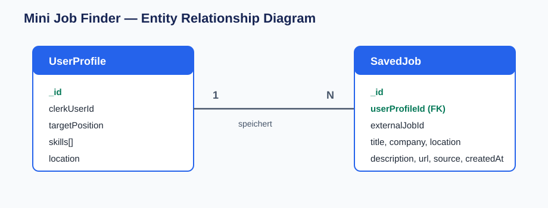

# Mini Job Finder

Ein Full-Stack-Lernprojekt mit Node.js, Express, MongoDB und Clerk.

Die Anwendung durchsucht lokale Stellenangebote, speichert ausgewählte Stellen und zeigt jedem Benutzer ausschließlich die eigenen gespeicherten Stellen.

## Projektziel

Praktische Übung von REST-APIs, Validierung, Datenbankmodellierung, Authentication, Authorization und API-Sicherheit.

## Umgesetzte Funktionen

- [x] 20 lokale Test-Stellenangebote aus `jobs.json`
- [x] Suche nach `keywords` und `location`
- [x] HTML-Interface: alle Stellen, Suche, Save und Saved Jobs
- [x] Speichern von Stellen in MongoDB
- [x] Beziehung `UserProfile 1 → N SavedJob`
- [x] Registrierung und Login per E-Mail mit Clerk
- [x] Geschützte Saved-Jobs-Routen
- [x] Datenisolation: Jeder Benutzer sieht nur eigene Stellen
- [x] Zod-Validierung, Helmet, CORS, Rate Limiting und Error Handler

## Verwendete Technologien

| Bereich | Technologie |
| --- | --- |
| Runtime / Backend | Node.js, Express |
| Datenbank / ODM | MongoDB Atlas, Mongoose |
| Validation | Zod |
| Authentication | Clerk, `@clerk/express` |
| API-Sicherheit | Helmet, CORS, express-rate-limit |
| Entwicklung | dotenv, Nodemon |
| Oberfläche | HTML, CSS, JavaScript |

## Datenmodell



```text
UserProfile 1 ─────── N SavedJob
```

`SavedJob.userProfileId` enthält die MongoDB-ID des zugehörigen `UserProfile`.

| UserProfile | SavedJob |
| --- | --- |
| clerkUserId | userProfileId |
| targetPosition | externalJobId |
| skills[] | title, company, location |
| location | description, url, source, createdAt |

## API-Endpunkte

| Methode | Endpoint | Beschreibung | Schutz |
| --- | --- | --- | --- |
| `GET` | `/api/jobs` | Liefert alle lokalen Stellenangebote | öffentlich |
| `GET` | `/api/jobs/search?keywords=frontend&location=Berlin` | Sucht nach Stichwort und Ort | öffentlich |
| `GET` | `/api/auth/me` | Liefert die ID des angemeldeten Benutzers | Clerk |
| `POST` | `/api/saved-jobs` | Speichert eine Stelle für den aktuellen Benutzer | Clerk |
| `GET` | `/api/saved-jobs` | Liefert nur eigene gespeicherte Stellen | Clerk |

Ohne Anmeldung antworten geschützte Routen mit:

```json
{ "message": "Unauthorized" }
```

## Installation und Start

```bash
npm install
npm run dev
```

Anwendung: `http://localhost:3000`

## Umgebungsvariablen

Erstelle eine Datei `.env`:

```env
PORT=3000
MONGODB_URI=deine_mongodb_verbindungszeichenfolge
CLERK_PUBLISHABLE_KEY=dein_clerk_publishable_key
CLERK_SECRET_KEY=dein_clerk_secret_key
```

`.env` ist in `.gitignore` und darf nicht in GitHub hochgeladen werden.

## Prüfungen

| Test | Ergebnis |
| --- | --- |
| `frontend` + `Berlin` | 3 Stellen |
| `node` + `Berlin` | 4 Stellen |
| `developer` + `Hamburg` | 5 Stellen |
| `frontend` + `Dresden` | 0 Stellen |
| Fehlende Suchparameter | `400 Bad Request` |
| Ungültiger Saved-Job-Body | `400 Bad Request` |
| Ohne Anmeldung | `401 Unauthorized` |
| Echter Clerk-Benutzer | Stelle speichern und abrufen erfolgreich |
| Zwei Clerk-Benutzer | Jeder sieht nur eigene Stellen |

## Planung und Ergebnis

| Geplante Aufgabe | Ergebnis |
| --- | --- |
| Node.js-/Express-Projekt einrichten und Server testen | ✅ umgesetzt und getestet |
| `jobs.json` mit 20 Teststellen erstellen | ✅ umgesetzt |
| `GET /api/jobs/search` implementieren und testen | ✅ umgesetzt und getestet |
| Query-Parameter mit Zod validieren | ✅ umgesetzt |
| MongoDB und die Modelle `UserProfile` / `SavedJob` erstellen | ✅ umgesetzt; 1:N-Beziehung geprüft |
| `POST` und `GET /api/saved-jobs` implementieren | ✅ umgesetzt und mit MongoDB geprüft |
| Authentication und Authorization umsetzen | ✅ mit Clerk umgesetzt; zwei Benutzer getestet |
| Rate Limiting, Helmet, CORS und Error Handler ergänzen | ✅ eingebunden |
| ERD und README fertigstellen | ✅ umgesetzt |
| Projekt auf GitHub vorbereiten | 🟡 `.gitignore` ist fertig; Commit/Push ist optional noch offen |

### Wichtigste Erkenntnis

Ich verstehe jetzt besser, wie Route, Controller, Validierung und Datenquelle zusammenarbeiten. Außerdem habe ich gelernt, wie Clerk einen Benutzer authentifiziert und wie `userProfileId` gespeicherte Stellen eindeutig einem Benutzer zuordnet.

### Vorgehen bei Hindernissen

Authentication und Authorization waren der aufwendigste Teil. Die Lösung war, jede Funktion in kleinen Schritten umzusetzen und direkt zu testen: zuerst mit Postman und MongoDB, danach mit dem HTML-Interface und zwei Clerk-Benutzern.

## Projektstruktur

```text
src/
├── config/        # MongoDB-Verbindung
├── controllers/   # API-Logik
├── data/          # jobs.json
├── middleware/    # Validation, Authentication, Security
├── models/        # Mongoose-Modelle
├── public/        # HTML, CSS, Frontend-JavaScript
├── routes/        # Express-Routen
└── schemas/       # Zod-Schemas
```

## Status

Der MVP ist fertig. Optional bleibt ein GitHub-Commit bzw. Push.
