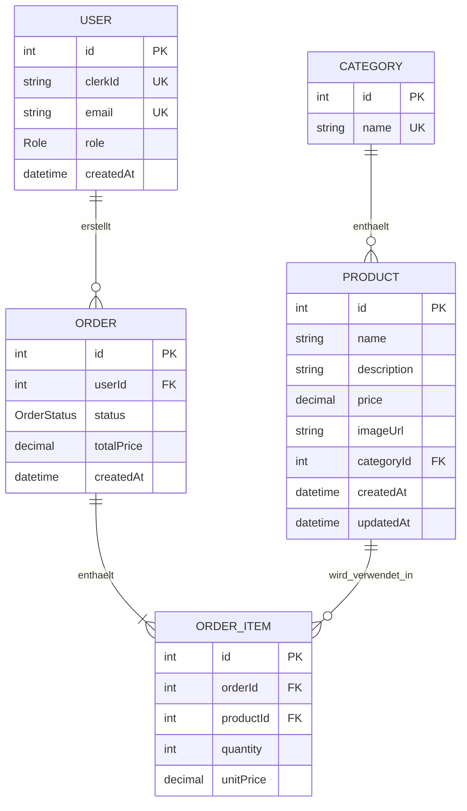

# ERD – Mini E-Commerce

[← Zum Datenmodell](./data-model.md)

```mermaid
erDiagram
    USER ||--o{ ORDER : erstellt
    CATEGORY ||--o{ PRODUCT : enthaelt
    ORDER ||--|{ ORDER_ITEM : enthaelt
    PRODUCT ||--o{ ORDER_ITEM : wird_verwendet_in

    USER {
        int id PK
        string clerkId UK
        string email UK
        Role role
        datetime createdAt
    }

    CATEGORY {
        int id PK
        string name UK
    }

    PRODUCT {
        int id PK
        string name
        string description
        decimal price
        string imageUrl
        int categoryId FK
        datetime createdAt
        datetime updatedAt
    }

    ORDER {
        int id PK
        int userId FK
        OrderStatus status
        decimal totalPrice
        datetime createdAt
    }

    ORDER_ITEM {
        int id PK
        int orderId FK
        int productId FK
        int quantity
        decimal unitPrice
    }
```
